# 03. Features

## 기능 구성

Investment AI Radar는 **종목 관리 → 정보 수집·등록 → 검토 → 사건 연결 → 일정·브리핑 → 사용자 판단** 흐름을 중심으로 구성했습니다.

각 기능 아래에 해당 화면과 시연 영상을 직접 연결해, 구현 내용과 증빙을 같은 위치에서 확인할 수 있도록 구성합니다.

## 전체 대시보드

  

오늘의 분석 화면에서 종목별 중요 정보, 일정, 브리핑과 관리 상태를 한 흐름으로 확인합니다.

## 1. 분석 종목

- 종목 등록·조회·수정
- 자산 유형과 시장 구분
- 보유·관심·재진입 관심·청산 완료 상태
- 종목 상세 분석
- 다음 확인 일정 연결

| 분석 종목 목록 | 종목 상세 분석 |
|:---:|:---:|
| 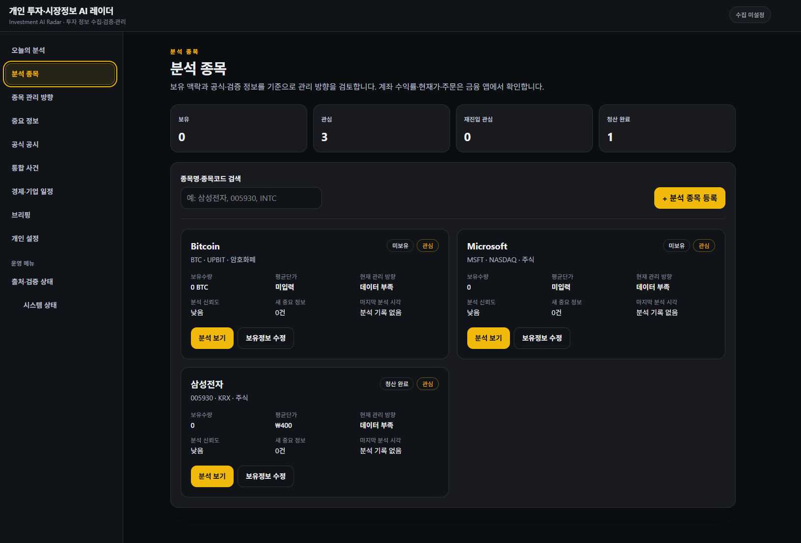 | 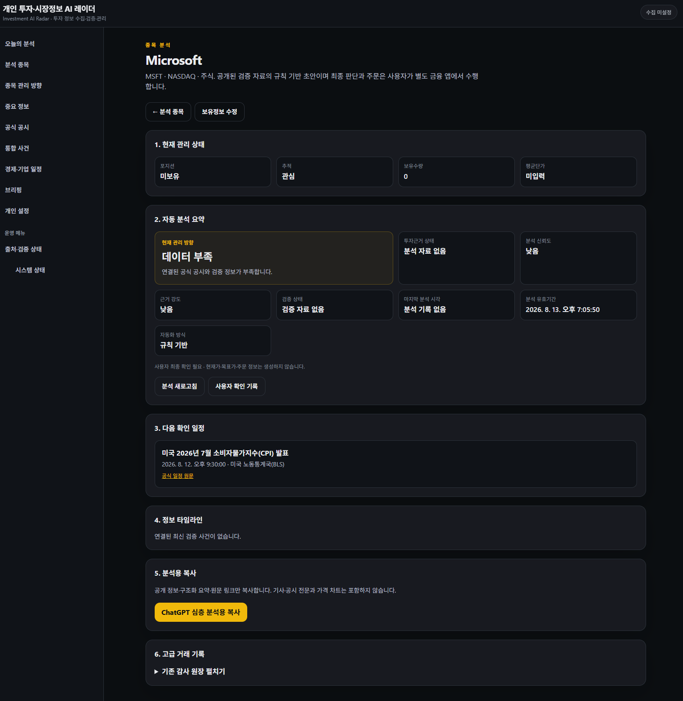 |

검증 영상:
[01 분석 종목 등록](videos/01_분석_종목_등록.mp4) ·
[02 분석 종목 수정·관리 방향](videos/02_분석_종목_수정_종목_관리_방향.mp4)

## 2. 거래 기록

- 매수·매도 거래 기록
- 과거 거래 입력
- 거래 수정과 soft void
- 보유 수량·평균단가 replay
- 매도 원가와 실현손익 계산
- 중복·잘못된 상태 전이 보호

검증 영상:
[03 고급 거래 기록](videos/03_분석_종목_고급_거래_기록.mp4)

## 3. 공식 출처와 구독

- 기관·회사 공식 출처 등록
- 출처 설정 변경
- 관심 기관·전문가 자동 확인 대상 관리
- 구독 변경 이력
- 공개 참고자료 자동 발견 후보 관리

| 공식 출처 관리 | 자동 구독·검토 대기 |
|:---:|:---:|
| 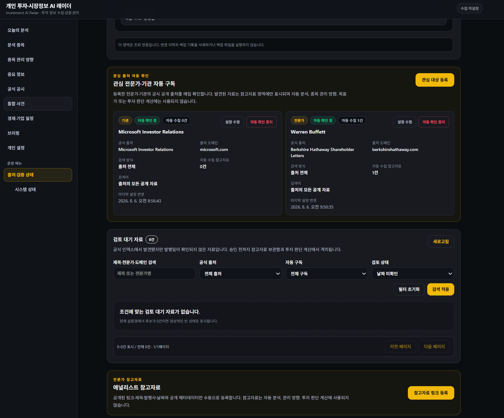 | 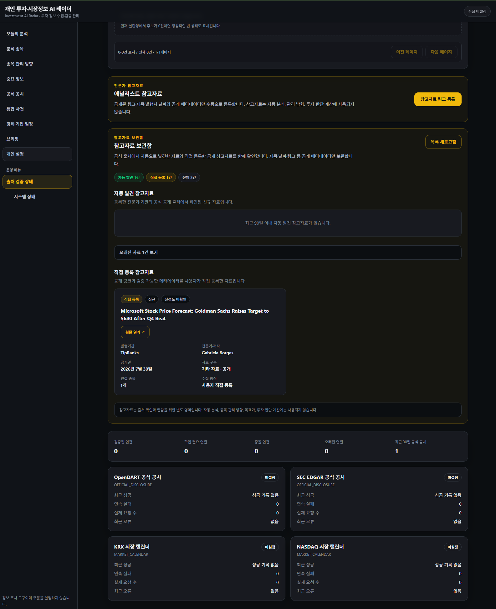 |

검증 영상:
[04 공식 출처 등록·수정](videos/04_공식_출처_등록_및_수정.mp4) ·
[05 출처 수정·관심 대상 등록](videos/05_출처_수정_및_관심_대상_등록.mp4)

## 4. 참고자료

- 애널리스트·전문가 공개 참고자료 직접 등록
- URL, 제목, 발행일, 저자·기관 메타데이터
- Portfolio 연결
- 참고자료 보관함
- 자동 발견 자료와 직접 등록 자료 분리

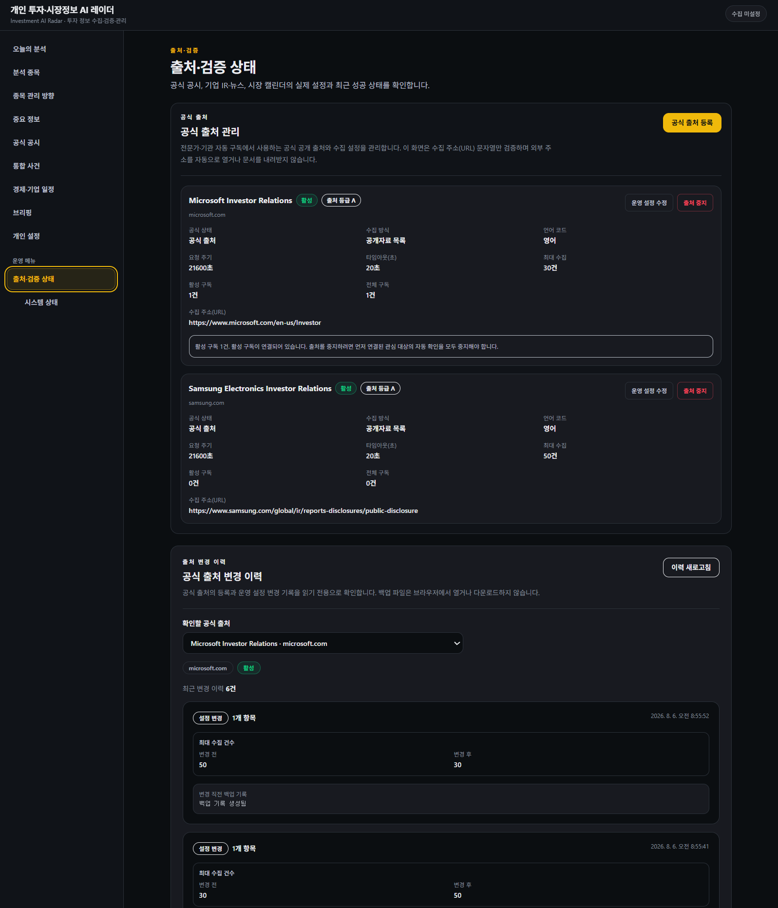

검증 영상:
[06 애널리스트 참고자료 등록](videos/06_애널리스트_참고자료_등록.mp4)

## 5. 검토 대기 자료

- 자동 발견 후보 staging
- 발행일 확인
- 정식 참고자료 승격
- 검토 제외와 제외 사유
- 최종 상태 보호
- 중복 제출과 409 충돌 처리
- pagination과 검색

검증 영상:
[07 검토 대기 자료](videos/07_검토_대기_자료.mp4)

## 6. 중요 정보

- URL 기반 등록 전 확인
- URL 정규화와 중복 검사
- 출처 분류
- 종목 연결
- Claim과 Information Event 생성
- 기사 전문 미저장

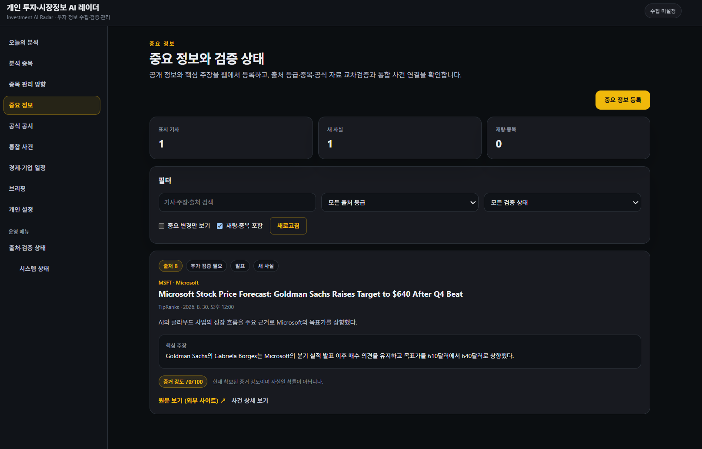

검증 영상:
[08 중요 정보 웹 등록·확인·통합 사건 연결](videos/08_중요_정보_웹_등록_검증_통합_사건_연결.mp4)

## 7. 공식 공시

- SEC 등 공식 원문 URL 등록
- 공시 유형·발행 시각 확인
- 종목 연결
- 통합 사건 후보 연결
- 공식 원문 링크 유지

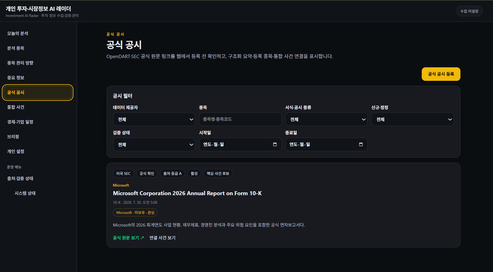

검증 영상:
[09 공식 공시 웹 등록·확인·통합 사건 연결](videos/09_공식_공시_웹_등록_검증_통합_사건_연결.mp4)

## 8. 통합 사건

- 반복 보도와 공식 자료를 사건 단위로 묶음
- 뉴스 참조·독립 원출처·공식 자료 수 표시
- 검토 상태와 공식 확인 상태 표시

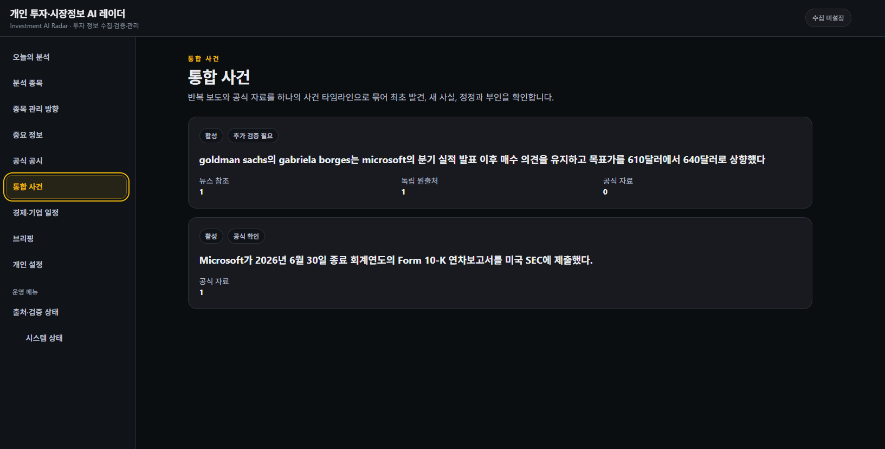

관련 검증 영상:
[08 중요 정보 → 통합 사건](videos/08_중요_정보_웹_등록_검증_통합_사건_연결.mp4) ·
[09 공식 공시 → 통합 사건](videos/09_공식_공시_웹_등록_검증_통합_사건_연결.mp4)

## 9. 경제·기업 일정

- 공식 발표 일정 URL 등록
- timezone-aware 시각
- 종목 연결
- 예상 영향 경로
- 발표 전 확인 목록
- 중복 일정 방지

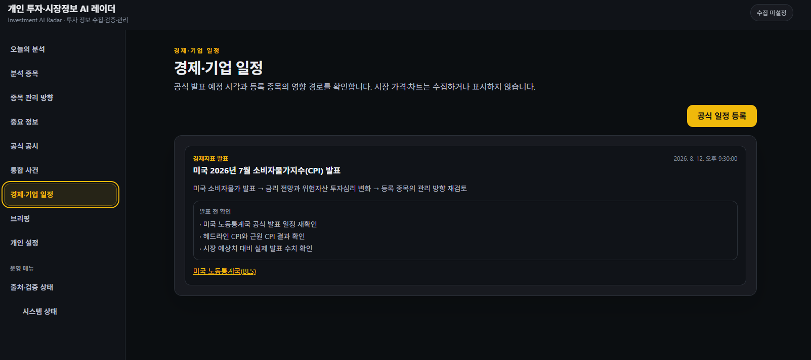

검증 영상:
[10 경제·기업 일정 웹 등록·종목 연결](videos/10_경제_기업_일정_웹_등록_종목_연결.mp4)

## 10. 변경 기반 브리핑

- 기간·중요도 조건 설정
- Preview와 Final 생성 분리
- 중복 상태 fingerprint 제외
- 중요 변경·공식 확인 수 표시
- 자동 이메일 발송과 분리

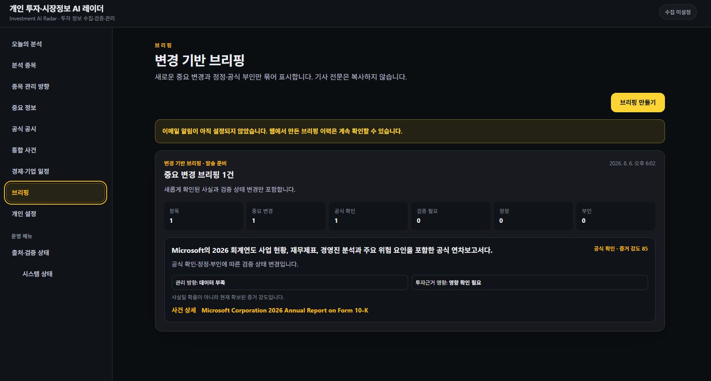

검증 영상:
[11 변경 기반 브리핑 생성·핵심 정보](videos/11_변경_기반_브리핑_생성_핵심_정보.mp4)

## 11. 위험 기준과 관리 방향

- 규칙 기반 위험 기준 제안
- 사용자 확인 후 적용
- 종목 관리 방향 준비 상태
- 데이터 부족·미설정 항목 명시
- 매수·매도·유지 명령, 목표가, 손절가, 상승 확률 미생성

| 관리 방향 준비 상태 | 위험 설정 자동 제안 |
|:---:|:---:|
| 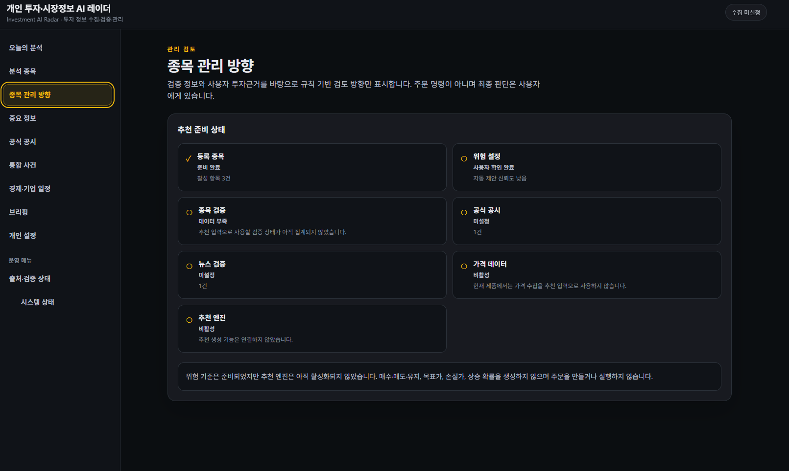 | 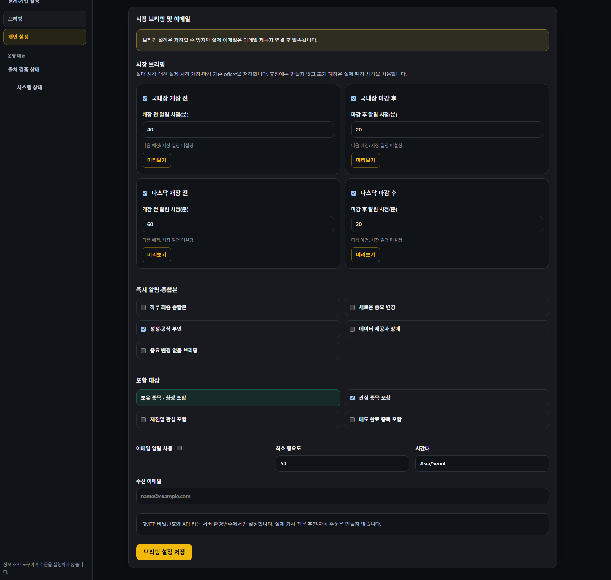 |

검증 영상:
[02 분석 종목 수정·관리 방향](videos/02_분석_종목_수정_종목_관리_방향.mp4) ·
[12 종목 관리 방향·준비 상태·관리 기준](videos/12_종목_관리_방향_준비_상태_관리_기준.mp4)

## 12. 개인 설정

- 국내장·NASDAQ 개장 전/마감 후 브리핑 offset
- 즉시 알림·종합본 조건
- 포함 대상 설정
- 이메일 설정과 최소 중요도
- 시간대 설정

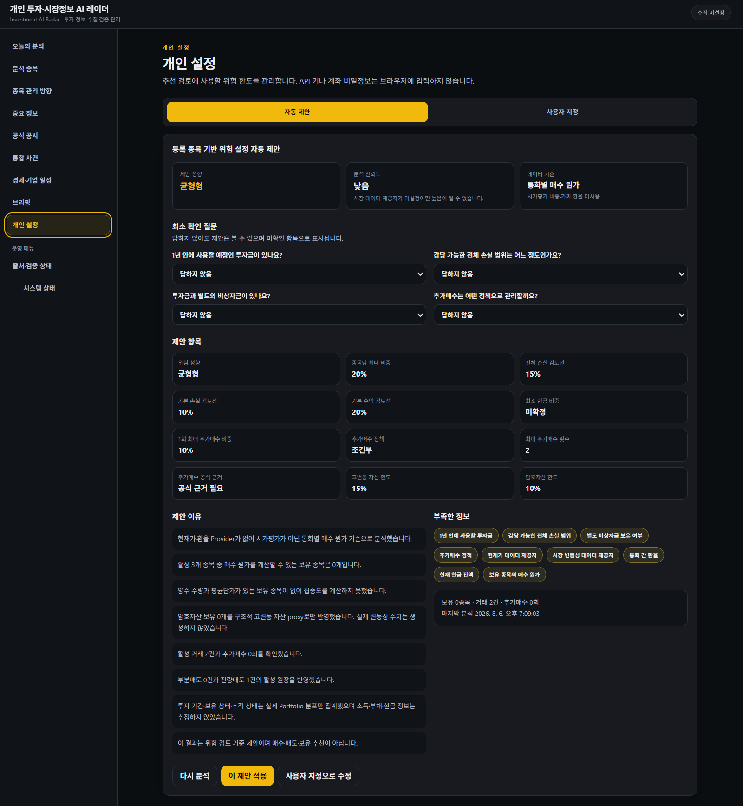

검증 영상:
[13 개인 설정·운영 상태·안전 기능](videos/13_개인_설정_운영_상태_안전_기능_확인.mp4)

## 13. 운영 상태

- 출처·검증 상태
- Provider 연결 상태
- 데이터베이스 상태
- 브리핑·자동화 상태
- 비활성·미설정 기능의 명시적 표시

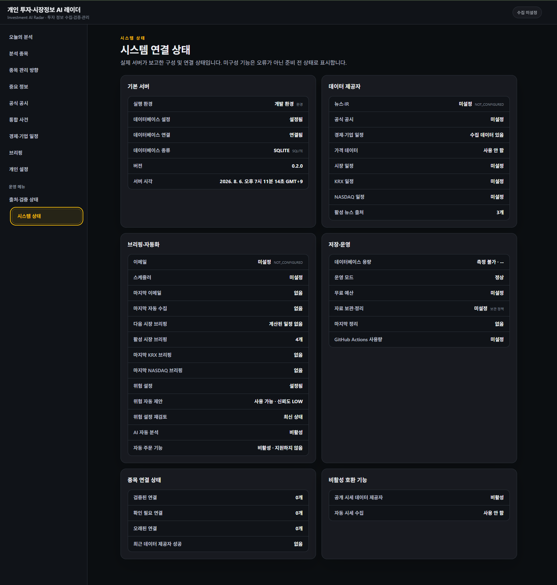

검증 영상:
[13 개인 설정·운영 상태·안전 기능](videos/13_개인_설정_운영_상태_안전_기능_확인.mp4)

## 기능 검증 요약

13개의 편집 영상은 각 기능 시나리오를 실제 UI 흐름으로 재실행해 확인한 **수동 기능 검증 증빙**입니다.

전체 자동화 QA와 영상별 검증 결과는 [05. Validation](05_validation.md), 전체 미디어 인덱스는 [10. Portfolio Media](10_portfolio_media.md)에 정리했습니다.

---

[문서 목차](README.md) · [프로젝트 README](../README.md)
